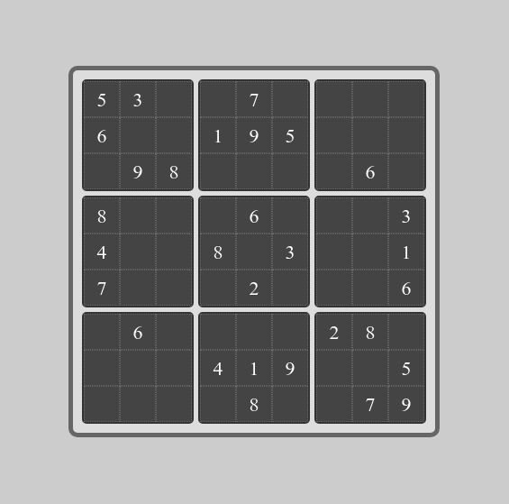
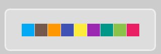

# Sudoku solver visualization

## General Info

Technology used:
* Python - backend
* Electron (HTML, CSS, JS) - frontend

## App Overview

Application was made to visualize solving Sudoku algorithm.
The main purpose is **not** to provide max performance of solving sudoku.  

Program shows:
* `deduction` method (looking for cells where only one digit is possible to input)
* `backtracking` method (attempting successive digits using threads: one thread for one depth-first search)

You can manually add/delete digit:

#### 'Deduction' method:

  

#### Backtracking method:

You can choose some initial options:
* interval [s]: break between attempting subsequent digits
* starting cells:
    * `first`: first empty cell (order: row by row)
    * `random`
    * `custom`: you can choose cell

  

  
(interval: 0.25)

At the end you can choose one of the found solutions that fills grid:  

